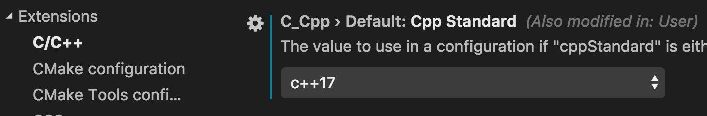
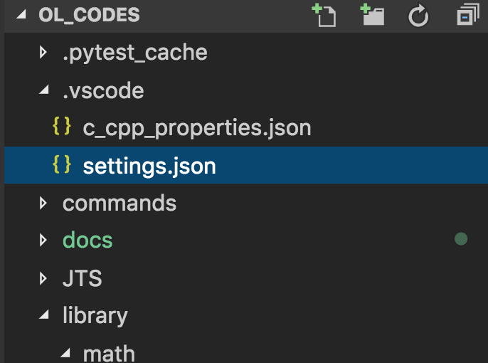

Solution to various coding problems
===================================

Fresh initiation on online coding. Code-gems was getting too big also moving to platform independent codes insted of windows only.

---

Using Visual Studio Code
========================
Project intented to work well with [visual studio code](https://code.visualstudio.com/). It's free, open source and available in all major platforms.

Extentions:

* [Code Runner](https://marketplace.visualstudio.com/items?itemName=formulahendry.code-runner)
* [Python](https://marketplace.visualstudio.com/items?itemName=ms-python.python)
* [C/C++](https://marketplace.visualstudio.com/items?itemName=ms-vscode.cpptools)

Other helpful extentions:

* [Trailing Spaces](https://marketplace.visualstudio.com/items?itemName=shardulm94.trailing-spaces)
* [Todo Tree](https://marketplace.visualstudio.com/items?itemName=Gruntfuggly.todo-tree)

Setting up extentions
---------------------

First change the syntax highlight settings to c++17 or higher



For code-runner, edit settings.json file in '.vscode' folder.



Append these settings into your workspace settings.

```json
{
    "code-runner.fileDirectoryAsCwd": true,
    "code-runner.runInTerminal": true,
    "code-runner.saveFileBeforeRun": true,
    "code-runner.customCommand": "python $workspaceRoot/commands/runner.py $fileName $workspaceRoot/library",
    "code-runner.executorMap": {
        "cpp": "cd $dir && g++ -I$workspaceRoot/library -std=c++17 -O2 -Wall -D LOCAL -o bin/$fileNameWithoutExt $fileName && ./bin/$fileNameWithoutExt"
    }
}

You can replace 'library' with 'shol/include' if you want to use [shol])(https://github.com/rahulsrma26/shol).
To use shol make sure you have used '--recursive'
```sh
git clone --recursive <URL to this Git repo>
```

```
Now to run a file just open it and press
<kbd>control</kbd>+<kbd>option</kbd>+<kbd>k</kbd> (on mac)
or <kbd>control</kbd>+<kbd>alt</kbd>+<kbd>k</kbd> (on pc).
---

Using code fetcher script
-------------------------
Run
```sh
    cd JTS
    python ../commands/fetcher.py <problem-url> <code-template>
```
